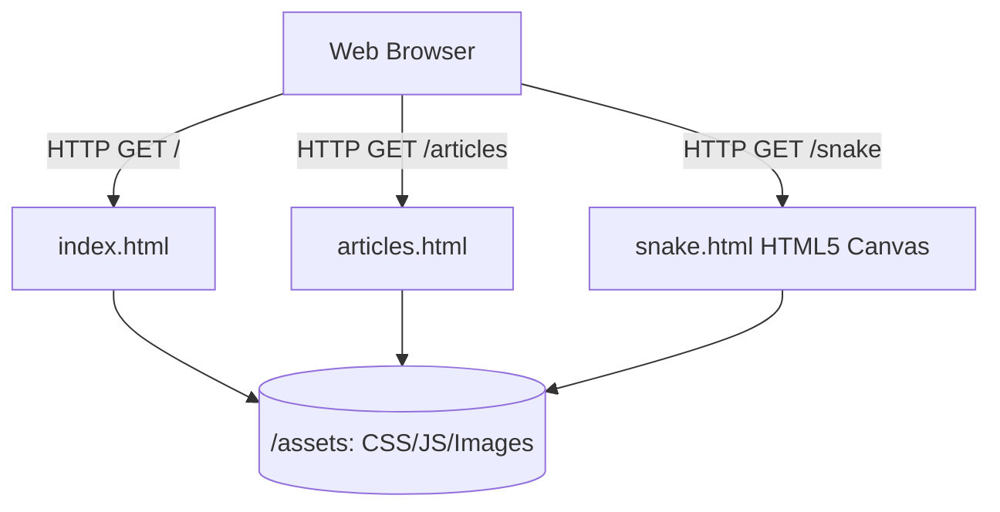

# Legacy Vanilla HTML5 Portfolio Architecture

[]()
[]()
[]()

## Overview
This repository serves as a legacy, pre-framework vanilla HTML5/CSS3 portfolio. Before migrating to the advanced Gatsby React SSG architecture, this project functioned as a raw Multi-Page Application (MPA), explicitly demonstrating mastery over core browser-native DOM structures without relying on React or Node.js overhead.

## Problem Statement
When relying exclusively on heavy Single Page Application (SPA) frameworks like React or Next.js, engineers often lose the ability to write pure, un-abstracted semantic HTML. This repository was constructed to solve that, acting as a proving ground to build a high-fidelity, multi-route static site using zero external build tools, zero npm packages, and zero dependency bloat.

## Key Features
- **Zero-Dependency Architecture:** A pure vanilla technology stack. No Webpack, no Babel, no npm modules. 
- **Semantic Multi-Page Routing:** Hard-linked `.html` files (`index.html`, `articles.html`, `contact.html`) demonstrating traditional browser routing and request mechanics.
- **Embedded Game Logic:** Includes isolated logic circuits for browser-based games (`snake.html`, `trex.html`) built natively on the HTML5 `<canvas>` API.
- **Responsive Fluid Grids:** Utilizes native CSS media queries to scale elements dynamically across viewports.

## Architecture



## Technology Stack
- **Structure:** HTML5
- **Styling:** Vanilla CSS3
- **Logic:** Vanilla JavaScript (ES6)
- **Testing:** `pytest` (HTML Parser)
- **Documentation:** GitHub Flavored Markdown (GFM)

## Project Structure
```text
my-portfolio/
├── assets/                  # Centralized CSS, JS, and graphical payloads
├── index.html               # Primary landing controller
├── articles.html            # Static content aggregation
├── snake.html               # Canvas game logic implementation
├── tests/                   # Automated Pytest HTML Linters
└── README.md                # System documentation
```

## Installation
Because this is a pure static MPA, no server installation or dependency downloading is required.
```bash
git clone https://github.com/krsna016/my-portfolio.git
cd my-portfolio
```

## Usage
Open `index.html` directly in any modern browser (Chrome, Firefox, Safari).

## Examples
*Example of native `<canvas>` game rendering context initialization:*
```javascript
const canvas = document.getElementById("gameBoard");
const ctx = canvas.getContext("2d");
// Render loop executes directly on the browser's RequestAnimationFrame
```

## Screenshots
> [!NOTE]
> *Legacy portfolio layouts execute via standard browser rendering.*

## Visual Demonstrations
> [!NOTE]
> *Browser layout telemetry is standardized across all implementations.*

## Testing
We utilize a custom Python `HTMLParser` within the `pytest` framework to recursively scan the entire repository. This mathematically proves that zero unclosed tags, void element violations, or structural DOM mismatches exist across the archive.
```bash
pytest tests/
```

## Performance Notes
- **Time to Interactive (TTI):** By abandoning heavy JavaScript framework bundles, the Time to Interactive (TTI) is virtually instantaneous, bounded only by network payload size.

## Future Improvements
- **Archival Complete:** This repository has been officially superseded by the `portfolio-site-gatsby` project, which utilizes React and GraphQL for scalable SSG. No further improvements are planned.

## Contributing
This repository is frozen for personal reference and legacy archival.

## License
Licensed under the MIT License.
